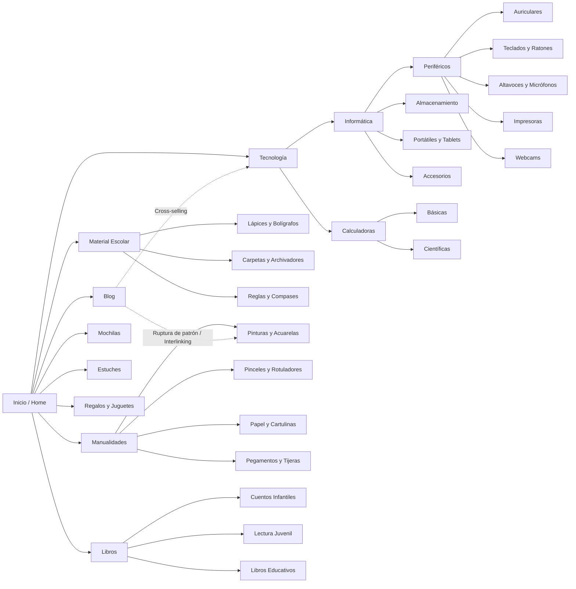

# Diagrama de categorías

```mermaid
flowchart LR

    Home[Inicio / Home] --> Cat1[Material Escolar]
    Home --> Cat2[Manualidades]
    Home --> Cat3[Libros]
    Home --> Cat4[Mochilas]
    Home --> Cat5[Estuches]
    Home --> Cat6[Regalos y Juguetes]
    Home --> Cat7[Tecnología]
    Home --> Blog[Blog]

    Cat1 --> Sub1A[Lápices y Bolígrafos]
    Cat1 --> Sub1B[Carpetas y Archivadores]
    Cat1 --> Sub1C[Reglas y Compases]

    Cat2 --> Sub2A[Pinturas y Acuarelas]
    Cat2 --> Sub2B[Pinceles y Rotuladores]
    Cat2 --> Sub2C[Papel y Cartulinas]
    Cat2 --> Sub2D[Pegamentos y Tijeras]

    Cat3 --> Sub3A[Cuentos Infantiles]
    Cat3 --> Sub3B[Lectura Juvenil]
    Cat3 --> Sub3C[Libros Educativos]

    %% Nueva rama profunda de Tecnología
    Cat7 --> Sub7A[Informática]
    Cat7 --> Sub7B[Calculadoras]

    Sub7A --> Sub7A1[Periféricos]
    Sub7A --> Sub7A2[Almacenamiento]
    Sub7A --> Sub7A3[Portátiles y Tablets]
    Sub7A --> Sub7A4[Accesorios]

    Sub7A1 --> Sub7A1_1[Auriculares]
    Sub7A1 --> Sub7A1_2[Teclados y Ratones]
    Sub7A1 --> Sub7A1_3[Altavoces y Micrófonos]
    Sub7A1 --> Sub7A1_4[Impresoras]
    Sub7A1 --> Sub7A1_5[Webcams]

    Sub7B --> Sub7B1[Básicas]
    Sub7B --> Sub7B2[Científicas]

    Blog -.->|Ruptura de patrón / Interlinking| Sub2A
    Blog -.->|Cross-selling| Cat7
```
